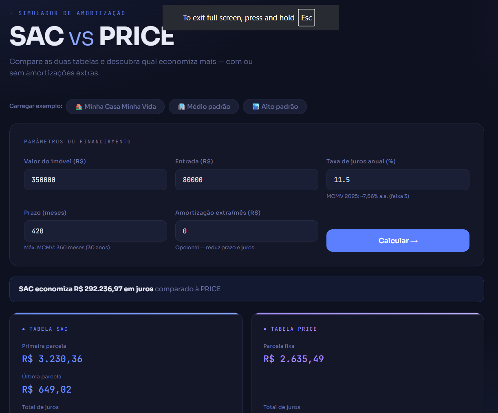
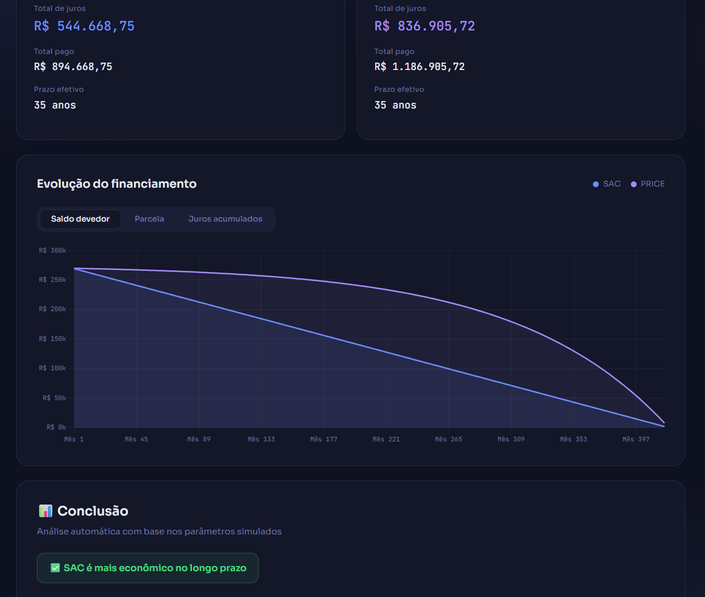
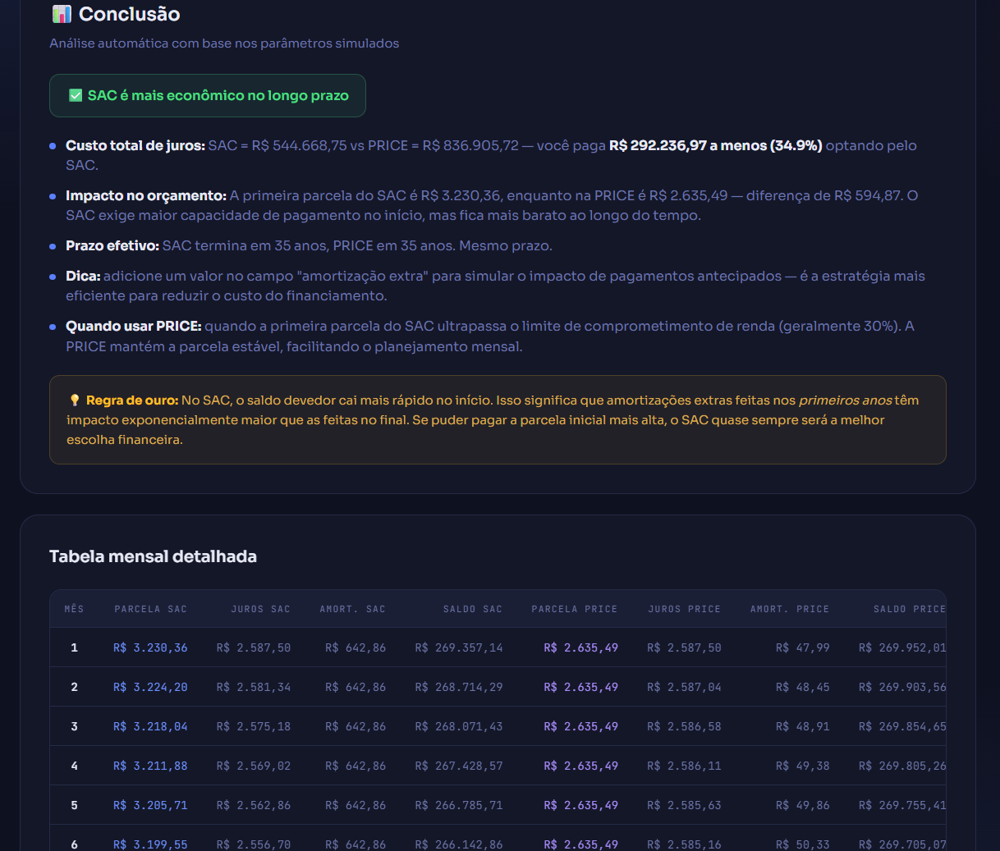

# 📊 Simulador de Amortização · SAC vs PRICE

Ferramenta interativa para comparar as duas principais tabelas de amortização usadas em financiamentos imobiliários no Brasil — **SAC** e **PRICE** — com suporte a amortização extra mensal.

🔗 **[Acesse o simulador ao vivo →](https://lydson.github.io/simulador-amortizacao/)**

---

## 📸 Preview







---

## 🎯 O que esse projeto faz

- Calcula e compara **SAC e PRICE** com os mesmos parâmetros simultaneamente
- Simula o efeito de **amortização extra mensal** — mostra quanto prazo e juros você economiza
- Exibe **3 gráficos interativos**: saldo devedor, parcela mensal e juros acumulados
- Gera uma **tabela completa** mês a mês com paginação
- Aponta automaticamente qual tabela é mais econômica e por quanto

---

## ⚠️ Limitações importantes (leia antes de usar)

O simulador assume um cenário **simplificado**:

| O simulador assume | A realidade no Brasil |
|---|---|
| Taxa fixa | TR variável (mesmo que baixa) |
| Sem seguro | Seguro MIP + DFI obrigatórios |
| Sem taxas administrativas | Tarifas mensais ou de contrato |
| Sem CET | CET sempre maior que a taxa nominal |
| Sem correção monetária | Pode ter IGPM, IPCA ou TR |

> **👉 Ou seja:** esse simulador **subestima o custo real** do financiamento.  
> Mas a **comparação SAC vs PRICE continua válida** — as diferenças relativas entre as tabelas se mantêm independente desses fatores adicionais.

Use como ponto de partida para entender a lógica. Para decisões reais, consulte sempre a proposta completa do banco com CET e seguro incluídos.

---

## 🛠️ Tecnologias utilizadas

- **HTML5 + CSS3 + JavaScript** — sem frameworks, sem dependências de build
- **[Chart.js](https://www.chartjs.org/)** — para os gráficos interativos (via CDN)
- **GitHub Pages** — deploy estático, zero custo

---

## 🧮 Como os cálculos funcionam

**SAC (Sistema de Amortização Constante)**
```
Amortização mensal = Saldo devedor / n meses
Juros do mês      = Saldo devedor × taxa mensal
Parcela           = Amortização + Juros  →  decresce ao longo do tempo
```

**PRICE (Sistema Francês)**
```
Parcela fixa  = PV × [i × (1+i)ⁿ] / [(1+i)ⁿ − 1]
Juros do mês  = Saldo devedor × taxa mensal
Amortização   = Parcela − Juros  →  cresce ao longo do tempo
```

**Amortização extra**  
Em ambas as tabelas, cada real amortizado além do mínimo reduz o saldo devedor imediatamente, diminuindo os juros do mês seguinte e encurtando o prazo total.

---

## 📈 Contexto de mercado (março 2026)

Taxas de referência para financiamento imobiliário no Brasil:

| Banco | Taxa |
|---|---|
| Caixa Econômica Federal | a partir de 10,26% a.a. + TR |
| Itaú | ~11,60% a.a. |
| Bradesco / Santander | 10,5% – 12,0% a.a. |

O default do simulador usa **11,5% a.a.** como valor central e realista para o perfil médio.

---

## 👤 Made by [Lydson](https://www.linkedin.com/in/lydson/)
